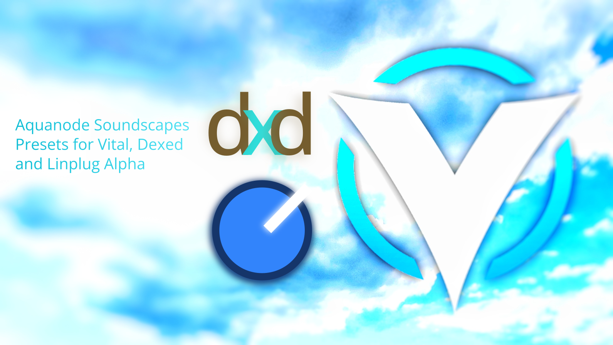
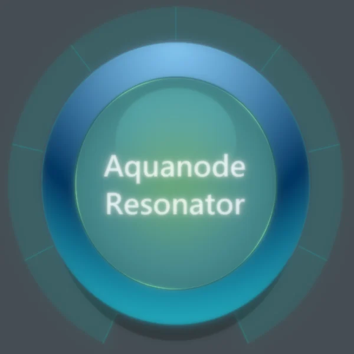
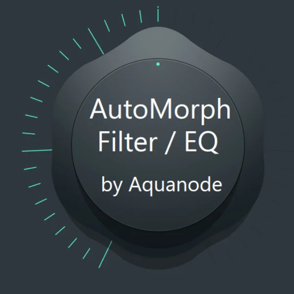
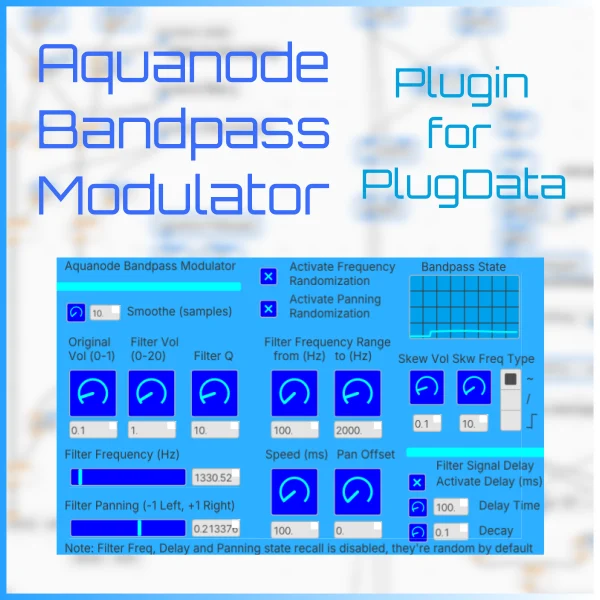

<p align="center">
  
</p>

# Aquanode Soundscapes

A collection of free synth presets, effect patches, and plugin recreations for Vital, FL Studio's Patcher, PlugData, Dexed / DX7, and LinPlug Alpha 3. Aquatic, ambient, and dubby sounds throughout.

# DOWNLOAD: https://github.com/aquanodemusic/aquanode-soundscapes/archive/refs/heads/main.zip

### I made all these presets, patches and plugins here 100% myself for the listed third-party programs. Many of the patches and plugins listed here can be considered obsolete as I turned them into real VSTs I offer in my other repository, but these VSTs are made with AI so if you want to stay 100% human-made then this repo here is for you.

If you want to support me, which I'd highly appreciate but you don't have to, then feel free to leave me a tip for my music on [bandcamp](https://aquanode.bandcamp.com), my songs are all free too!

🌊 [bandcamp](https://aquanode.bandcamp.com) · [youtube](https://www.youtube.com/@aquanodemusic)

## What's Included

| Preset / Patch / Plugin | Description |
|----------------|-------------|
| <br />**[Aquanode Resonator](fl-studio/aquanode-resonator/)**<br />*FL Studio Patcher* | A resonator effect for FL Studio, replicating Ableton's Resonator with stock plugins. Includes multiple versions with individual dampening, panning, fine pitch, stereo width, and "signal through" control per resonator. |
| <br />**[AutoMorph EQ](fl-studio/automorph-eq/)**<br />*FL Studio Patcher* | 9 morphing EQ / filter presets inspired by Morph EQ, E-MU z-Plane filters, and Zynaptiq Pitchmap: LFO, Sweep, Static, Spread, BandpassMod, Chord, PitchControl, Play, and Partials EQ - from automated filter sweeps and pitch-locking filterbanks to a MIDI-playable EQ. |
| <br />**[D3lt4 Creative Polarity Inverter](fl-studio/d3lt4-creative-polarity-inverter/)**<br />*FL Studio Patcher* | A polarity inversion / phase cancellation preset inspired by oeksound's "Delta" option. Hear only the changes your effect chain introduces into a sound - comes in PASSIVE (the one you usually need) and ACTIVE versions plus an example project. |
| <br />**[Bandpass Modulator](plugdata/bandpass-modulator/)**<br />*PlugData* | A randomly jumping, skew-modulated bandpass filter as a free, cross-platform PlugData patch (works in all VST-capable DAWs). Filter FM sounds, bubbly effects, mellow panning and delay. Includes all 3 versions (v0–v2) plus the original FL Studio patch. |
| <br />**[Aquanode Soundscapes for Vital](vital/)**<br />*Vital* | 300+ presets for the Vital synthesizer: nature soundscapes (Ecophony), Ambient, DnB, Dub Techno, Psychill, FM, FX and Pad patches, plus 113 remakes of sounds from artists like Ekhozone, Solar Fields, and Carbon Based Lifeforms - with matching MIDI files. |
| 🎹🌿<br />**[DX7 / Dexed Presets](dexed/)**<br />*Dexed, Sytrus, FM8, DX7* | Yamaha DX7 SysEx banks: my own patches plus remakes of Ekhozone's album *Infinite Cycles*, with MIDI files and a pre-arranged FL Studio project. |
| 💧🌿<br />**[LinPlug Alpha 3 Presets](linplug-alpha-3/)**<br />*LinPlug Alpha 3 (free version)* | 63 presets for the discontinued LinPlug Alpha 3 synth - deep, lush, aquatic basses, subs, pads, and atmospheres, such as those heard in my own tracks "Aqua Zone", "Metallic Waters" and a few others. |

## Repository Structure

```
├── dexed/                                  DX7 SysEx banks + MIDI + FL Studio project
├── fl-studio/
│   ├── aquanode-resonator/                 Resonator patch, versions V1–V5
│   ├── automorph-eq/                       9 morphing EQ presets (one folder each)
│   └── d3lt4-creative-polarity-inverter/   The PASSIVE and ACTIVE versions
├── linplug-alpha-3/                        .fxp presets
├── plugdata/
│   └── bandpass-modulator/                 .pd patches v0–v2 + FL Studio version
└── vital/
    └── Aquanode Soundscapes                .vital presets, ready to move to your vital preset directory
```

Each project folder contains its own README with full descriptions, parameter documentation, version histories, and installation instructions.

Have fun with the presets! - Aquanode
