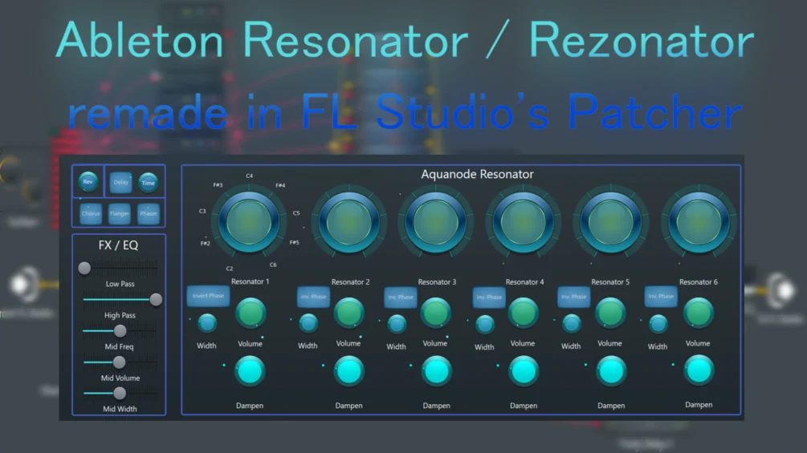

# Aquanode Resonator



A resonator plugin / preset for FL Studio's Patcher, inspired by an already existing resonator preset that is harder to use and not as versatile as my version. It works and sounds as similar as I was able to make it to Ableton's Resonator. Simply drag & drop it on a mixer track and the effect works.

While it is a little CPU intensive and might not capture all the characteristics of the originals, it might be a nice alternative for you and offers some additional features like individual dampening control. My version also allows individual inverting, decay time, and stereo width settings per resonator, which the other versions only allow globally for all resonators.

The newest Version 5 also contains fine pitch sliders, a panning knob for all resonators, and a "signal through" knob that changes how much of the incoming signal reaches the resonators. This is useful for cutting off the incoming signal while the resonators still resonate out the remaining signal, instead of getting turned off with the volume knob.

🎥 See it in action: https://www.youtube.com/watch?v=gm1T1AIoMyA

> **Note:** This resonator is a patch for FL Studio only. I also offer a real VST3 resonator plugin in my *Aquanode Plugins* Bundle.

## Requirements

- All versions below V5 should work in the **Producer Edition** of FL Studio.
- Version 3 requires at least **FL Studio 24**; for Version 2.2 or below, FL Studio 21 or maybe even lower should be fine.
- Version 5 requires the **Pitch Shifter** plugin (part of the All Plugins Bundle Edition).

## Version History

All versions are included in this folder — pick the one that fits your FL Studio edition and CPU budget.

### I recommend using version 4.2!

| Version | File | Changes |
|---------|------|---------|
| V1 | `Patcher - Aquanode Resonator V1.fst` | Crude experimental version, trying to get a single closed-form solution for converting resonator knob values to note millisecond values in the Flanger, using rounding / exponential functions (the ratio between two notes in 12-tone equal temperament should be the same). Not exact enough, since the Fruity Flanger has limited millisecond precision. |
| V2.1 | `Patcher - Aquanode Resonator V2.1.fst` | The simplest "accurate" version — only the resonators and EQ, for low CPU usage. |
| V2.2 | `Patcher - Aquanode Resonator V2.2.fst` | V2.1 + added Multi FX unit (Delay, Reverb, Chorus, Flanger, Phaser). |
| V3 | `Patcher - Aquanode Resonator V3.fst` | Added Stereorizers to emulate the resonator width control from Ableton's Resonator. Relatively high CPU usage but "the full package". |
| V4.1 | `Patcher - Aquanode Resonator V4.1.fst` | Added panning knobs for all resonators and a "Through" knob defining how much of the incoming audio reaches the resonators. Unlike the volume or damping knobs, turning down Through while the resonators are still resonating means no new signal reaches them, but they still resonate out instead of getting quiet. |
| V4.2 | `Patcher - Aquanode Resonator V4.2.fst` | Added a Dry knob, since the Through knob blocks the dry signal when turned off. With the Dry knob, the wet signal is now independent — you can freely stop the dry and wet signal individually. |
| V5 | `Patcher - Aquanode Resonator V5.fst` | Added fine pitch sliders to detune the resonators up to ±1 semitone. For simplicity this uses FL Studio's Pitch Shifter, since doing it inside the Flanger would require another huge formula (Fruity Formula Controllers do not remember relative settings). Also added a frequency shifter effect knob, which sounds especially nice with reverb on. The Pitch Shifter might introduce some artifacts. |

## Technical Appendix

<details>
<summary><strong>How it works / Credits</strong></summary>

The Aquanode Resonators replicate the Ableton Resonators / Rezonator by Xynth Audio Effect Plugins by adapting the Fruity Flanger resonator setting by Nucleon / Youlean. Unlike their preset, which relies on MIDI Out channels, my version is "standalone".

Designed in 2024 by Aquanode using stock FL Studio effects and the general idea from the Nucleon / Youlean Resonator Patcher preset.

</details>

<details>
<summary><strong>Fruity Formula Controller logic</strong></summary>

This is the formula used to make the Flanger note positions as accurate as possible. The ranges for `a` are needed since the knob does not react anymore if you type in a more exact value.

```
if((a>=0.000 and a<=0.010), 0.94140625,
if((a>=0.019 and a<=0.021), 0.9287109375,
if((a>=0.040 and a<=0.042), 0.9140625,
if((a>=0.061 and a<=0.063), 0.900390625,
if((a>=0.082 and a<=0.084), 0.8857421875,
if((a>=0.104 and a<=0.105), 0.8701171875,
if((a>=0.124 and a<=0.126), 0.8544921875,
if((a>=0.145 and a<=0.147), 0.8388671875,
if((a>=0.165 and a<=0.167), 0.8232421875,
if((a>=0.166 and a<=0.168), 0.8232421875,
if((a>=0.187 and a<=0.189), 0.806640625,
if((a>=0.207 and a<=0.209), 0.7900390625,
if((a>=0.228 and a<=0.230), 0.7724609375,
if((a>=0.249 and a<=0.251), 0.755859375,
if((a>=0.270 and a<=0.272), 0.73828125,
if((a>=0.291 and a<=0.293), 0.720703125,
if((a>=0.312 and a<=0.314), 0.703125,
if((a>=0.332 and a<=0.334), 0.6845703125,
if((a>=0.353 and a<=0.356), 0.6669921875,
if((a>=0.374 and a<=0.376), 0.6494140625,
if((a>=0.395 and a<=0.397), 0.630859375,
if((a>=0.416 and a<=0.418), 0.61328125,
if((a>=0.437 and a<=0.439), 0.5947265625,
if((a>=0.457 and a<=0.459), 0.5771484375,
if((a>=0.478 and a<=0.480), 0.55859375,
if((a>=0.490 and a<=0.510), 0.5419921875,
if((a>=0.520 and a<=0.522), 0.5234375,
if((a>=0.541 and a<=0.543), 0.5068359375,
if((a>=0.562 and a<=0.564), 0.4892578125,
if((a>=0.582 and a<=0.584), 0.4716796875,
if((a>=0.603 and a<=0.605), 0.455078125,
if((a>=0.624 and a<=0.626), 0.4384765625,
if((a>=0.645 and a<=0.647), 0.4228515625,
if((a>=0.665 and a<=0.668), 0.40625,
if((a>=0.687 and a<=0.689), 0.390625,
if((a>=0.707 and a<=0.709), 0.375,
if((a>=0.728 and a<=0.730), 0.3603515625,
if((a>=0.749 and a<=0.751), 0.345703125,
if((a>=0.770 and a<=0.772), 0.3310546875,
if((a>=0.791 and a<=0.793), 0.3173828125,
if((a>=0.812 and a<=0.814), 0.3037109375,
if((a>=0.832 and a<=0.834), 0.291015625,
if((a>=0.853 and a<=0.855), 0.2783203125,
if((a>=0.874 and a<=0.876), 0.2666015625,
if((a>=0.895 and a<=0.897), 0.25390625,
if((a>=0.916 and a<=0.918), 0.2421875,
if((a>=0.937 and a<=0.939), 0.2314453125,
if((a>=0.957 and a<=0.959), 0.220703125,
if((a>=0.978 and a<=0.980), 0.2109375,
if((a>=0.999 and a<=1.000), 0.2001953125,
0
))))))))))))))))))))))))))))))))))))))))))))))))))
```

</details>

<details>
<summary><strong>Notes to Milliseconds conversion chart</strong></summary>

A list of notes, their frequencies (based on A4 = 440 Hz), and their conversion into milliseconds — used to tune the Flanger delay times to musical pitches.

| Note | Frequency (Hz) | Time (ms) |
|------|----------------|-----------|
| C1 | 32.703 | 30.5780515 |
| C#1 | 34.648 | 28.8618373 |
| D1 | 36.708 | 27.2419469 |
| D#1 | 38.891 | 25.7129739 |
| E1 | 41.203 | 24.2698155 |
| F1 | 43.654 | 22.9076555 |
| F#1 | 46.249 | 21.6219475 |
| G1 | 48.999 | 20.4084009 |
| G#1 | 51.913 | 19.2629654 |
| A1 | 55.000 | 18.1818182 |
| A#1 | 58.270 | 17.1613511 |
| B1 | 61.735 | 16.1981585 |
| C2 | 65.406 | 15.2890257 |
| C#2 | 69.296 | 14.4309187 |
| D2 | 73.416 | 13.6209734 |
| D#2 | 77.782 | 12.8564869 |
| E2 | 82.407 | 12.1349078 |
| F2 | 87.307 | 11.4538277 |
| F#2 | 92.499 | 10.8109738 |
| G2 | 97.999 | 10.2042004 |
| G#2 | 103.826 | 9.6314827 |
| A2 | 110.000 | 9.0909091 |
| A#2 | 116.541 | 8.5806756 |
| B2 | 123.471 | 8.0990793 |
| C3 | 130.813 | 7.6445129 |
| C#3 | 138.591 | 7.2154593 |
| D3 | 146.832 | 6.8104867 |
| D#3 | 155.563 | 6.4282435 |
| E3 | 164.814 | 6.0674539 |
| F3 | 174.614 | 5.7269139 |
| F#3 | 184.997 | 5.4054869 |
| G3 | 195.998 | 5.1021002 |
| G#3 | 207.652 | 4.8157413 |
| A3 | 220.000 | 4.5454545 |
| A#3 | 233.082 | 4.2903378 |
| B3 | 246.942 | 4.0495396 |
| C4 | 261.626 | 3.8222564 |
| C#4 | 277.183 | 3.6077297 |
| D4 | 293.665 | 3.4052434 |
| D#4 | 311.127 | 3.2141217 |
| E4 | 329.628 | 3.0337269 |
| F4 | 349.228 | 2.8634569 |
| F#4 | 369.994 | 2.7027434 |
| G4 | 391.995 | 2.5510501 |
| G#4 | 415.305 | 2.4078707 |
| A4 | 440.000 | 2.2727273 |
| A#4 | 466.164 | 2.1451689 |
| B4 | 493.883 | 2.0247698 |
| C5 | 523.251 | 1.9111282 |
| C#5 | 554.365 | 1.8038648 |
| D5 | 587.330 | 1.7026217 |
| D#5 | 622.254 | 1.6070609 |
| E5 | 659.255 | 1.5168635 |
| F5 | 698.456 | 1.4317285 |
| F#5 | 739.989 | 1.3513717 |
| G5 | 783.991 | 1.2755251 |
| G#5 | 830.609 | 1.2039353 |
| A5 | 880.000 | 1.1363636 |
| A#5 | 932.328 | 1.0725844 |
| B5 | 987.767 | 1.0123849 |
| C6 | 1046.502 | 0.9555641 |
| C#6 | 1108.731 | 0.9019324 |
| D6 | 1174.659 | 0.8513108 |
| D#6 | 1244.508 | 0.8035304 |
| E6 | 1318.510 | 0.7584317 |
| F6 | 1396.913 | 0.7158642 |
| F#6 | 1479.978 | 0.6756859 |
| G6 | 1567.982 | 0.6377625 |
| G#6 | 1661.219 | 0.6019677 |
| A6 | 1760.000 | 0.5681818 |
| A#6 | 1864.655 | 0.5362922 |
| B6 | 1975.533 | 0.5061925 |
| C7 | 2093.005 | 0.4777821 |
| C#7 | 2217.461 | 0.4509662 |
| D7 | 2349.318 | 0.4256554 |
| D#7 | 2489.016 | 0.4017652 |
| E7 | 2637.020 | 0.3792159 |
| F7 | 2793.826 | 0.3579321 |
| F#7 | 2959.955 | 0.3378429 |
| G7 | 3135.963 | 0.3188813 |
| G#7 | 3322.438 | 0.3009838 |
| A7 | 3520.000 | 0.2840909 |
| A#7 | 3729.310 | 0.2681461 |
| B7 | 3951.066 | 0.2530962 |
| C8 | 4186.009 | 0.2388910 |
| C#8 | 4434.922 | 0.2254831 |
| D8 | 4698.636 | 0.2128277 |
| D#8 | 4978.032 | 0.2008826 |
| E8 | 5274.041 | 0.1896079 |
| F8 | 5587.652 | 0.1789661 |
| F#8 | 5919.911 | 0.1689215 |
| G8 | 6271.927 | 0.1594406 |
| G#8 | 6644.875 | 0.1504919 |
| A8 | 7040.000 | 0.1420455 |
| A#8 | 7458.620 | 0.1340731 |
| B8 | 7902.133 | 0.1265481 |

Generated with this Python script:

```python
import math

def note_frequencies(reference_freq, note_names, octave_range):
    notes_info = []
    note_position = {
        "C ": -9, "C#": -8, "D ": -7, "D#": -6, "E ": -5, "F ": -4, "F#": -3,
        "G ": -2, "G#": -1, "A ": 0, "A#": 1, "B ": 2
    }
    for octave in octave_range:
        for note in note_names:
            noteposition = note_position[note] + (octave - 4) * 12
            frequency = reference_freq * (2 ** (noteposition / 12.0))
            milliseconds = 1000 / frequency
            notes_info.append([f"{note}{octave}", frequency, milliseconds])
    return notes_info

def print_note_details(note_details):
    for note, frequency, milliseconds in note_details:
        print(f"Note: {note}, Frequency: {frequency:.3f} Hz, Time: {milliseconds:.7f} ms")

reference_freq = 440.0
note_names = ["C ", "C#", "D ", "D#", "E ", "F ", "F#", "G ", "G#", "A ", "A#", "B "]
octave_range = range(1, 9)

note_details = note_frequencies(reference_freq, note_names, octave_range)
print_note_details(note_details)
```

</details>
