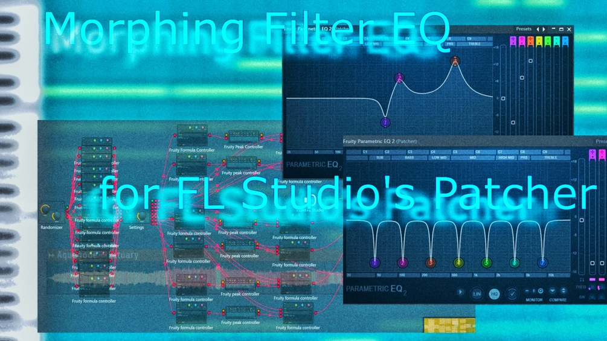

# AutoMorph EQ

AutoMorph EQ is a collection of 9 morphing EQ / filter presets for FL Studio's Patcher environment, using Fruity Parametric EQ 2 automations to create interesting filter effects — inspired by Morph EQ from Minimal Audio, E-MU's z-Plane filter technology, Zynaptiq's Pitchmap pitch colorization techniques, and more unique ideas. All offered for free.

With them you can create morphing equalizer bands, automated bandpass filters like in Korg's workstation synthesizers, individual note pitch finetuning to generate chords out of ambient noise soundscapes, and even play the EQ like a synthesizer with MIDI keyboard input.

🎥 Watch them in action:

- Automatic EQs: https://youtu.be/RwQvYsryn6w
- Bandpass FX: https://youtube.com/shorts/0yA7b15ckms
- Pitch finetuning: https://youtu.be/srZ2rMXdkhA
- MIDI keyboard mapped EQ: https://youtu.be/dNR9dd5EeHs
- Pitch Colorizer (previous versions): https://www.youtube.com/shorts/VXRQKGEPTxs

**How to use (all presets):** Drag and drop the `.fst` file onto a mixer track and it opens automatically. Alternatively, paste the file into FL Studio's preset directory and it will appear under your installed effects. Some presets also ship with an example `.flp` project.

---

## The Presets

### 🎚 LFO EQ (`automorph-lfo-eq`)

A three-band morphing EQ with freely oscillating and evolving filter bands and many randomization options. It can generate anything from smooth, slow filter sweeps to Filter FM sounds at very fast LFO speeds.

The preset has four tabs:

1. **Map** – The routing for making the preset.
2. **Internal** – Knobs being automated, linked to the EQ band parameters. Don't use these for setting up the EQ; they get overwritten constantly by the automations. Band volumes and frequencies are directly linked to the Fruity Parametric EQ 2 and visualize the current state of the automated bands.
3. **Settings** – The main tab. All knobs and sliders are linked to Fruity Peak Controllers controlling volumes and frequencies of the three EQ bands:
   - **Vol Base:** Where the baseline for the volume change is. At 0% the full −12 to +12 dB range is enabled; higher values decrease the available range.
   - **Vol Depth:** How much of the available dB change range is used.
   - **Freq Base / Freq Depth:** Same, but for the frequency range.
   - **Activate Band:** (De)activates the automation for the band (linked to the Parametric EQ directly).
   - **Vol LFO Type / Speed** and **Freq LFO Type / Speed:** LFO shape (sine, triangle, noise, …) and cycle length per parameter.
4. **Randomize** – A pseudo-randomizer for generating presets:
   - **Randomize:** A modulo function in a Fruity Formula Controller generates a pseudo-random number that feeds all LFO types and speeds — basically a couple hundred presets, since the random numbers for a given knob position are fixed.
   - **Speed Multiply:** Uniformly slows down all automations relative to their values, since randomized LFO speeds can get very fast (into Filter FM territory).

### 🎚 Sweep EQ (`automorph-sweep-eq`)

An automatic morph EQ which continuously morphs between two assignable Fruity Parametric EQ 2 filter settings. Comes in two versions: a **3-band** version (lower CPU usage) and a **6-band** version (more visible modulations at once — nice visuals when opening the Parametric EQ GUI). An example project (`AutoMorph Sweep Project.flp`) is included.

- **Activate:** Enables/disables the selected band's filter sweeping.
- **Vol Start / Vol End:** The volume range being oscillated between (y-axis).
- **Freq Start / Freq End:** The frequency range being oscillated between (x-axis).
- **Morph Speed:** The oscillating speed between the two filter states.

Good to know: if Start is bigger than End, the oscillation swaps direction — e.g. while Vol 1 goes up (Start < End), Vol 2 with Start > End goes down simultaneously.

### 🎚 Static EQ (`automorph-static-eq`)

Does the same as Sweep EQ, but instead of an LFO oscillating between the morph positions, you set the transition slice between the start and stop positions by hand with a global morph controller — a little like the wave frame of a wavetable. This is the closest "linear morphing" effect in the pack.

Morphing can also be automated with **LFO Pos** in the Global tab; unlike Sweep EQ, this LFO is synchronised across all morph position knobs (all move from 0 to 1 and back at the same speed). The Global tab also has a knob controlling all band widths. All other knobs and sliders behave like Sweep EQ. Tip: open the Parametric EQ in the Map routing tab to see the effects!

### 🎚 Spread EQ (`automorph-spread-eq`)

A static, Phaser-like 7-band preset where the EQ peaks get spread equidistantly over the frequency spectrum. An example project is included.

- **Volume:** Peak volume of the bands (−12 to +12 dB).
- **Center Freq.:** The center frequency around which the bands are dispersed (band 4 stays here).
- **Spread:** The frequency range between two band peaks.
- **Wobble:** Introduces a slight frequency wobble effect if activated.

### 🎚 BandpassMod EQ (`automorph-bandpassmod-eq`)

A bandpass modulation effect for evolving pads, inspired by the Random and Modulation filters from the Korg Triton workstation synthesizer. It modulates the spectral position of a bandpass filter: it can jump to a different frequency band after a short pause, move to it quickly, or a combination of both — move a bit, then jump (controlled in the "Skew" section). You can almost get "water bubble" sound effects from the skewing.

Also available as a standalone [PlugData plugin](../../plugdata/bandpass-modulator/) in this repo.

| Parameter | Description |
|-----------|-------------|
| Vol Dry / Vol Wet | How much unaltered / altered signal is audible. |
| Low Limit / High Limit | Frequency limits for the bandpass peak positions. If High < Low, their roles swap. |
| Fine | Shrinks the jumping interval on both ends, keeping a smaller interval in the middle. Example: Low 1000 Hz, High 2000 Hz, Fine 50% → jumps only between 1250–1750 Hz. |
| Speed | Time until the bandpass jumps to another (random) value. |
| Mod Type | Random jumps at 100%, can also be sine curves or similar. |
| Bandwidth / Strength | Frequency width and strength of the bandpass filter. |
| FX: Dist / Delay Speed / Delay Vol / Reverb | Distortion, delay (active if Delay Vol > 0%), and reverb after the delayed signal. |
| Autopan | Random stereo panning of the bandpassed signal and its strength. |
| Skew Type / Speed / Amt | Adds another bandpass modulation on top of the main one — e.g. a quieter, faster sine wave added to the moving filter. Smoothes the jumps. |

### 🎚 Chord EQ (`automorph-chord-eq`)

12 EQ bands, each tuned to one note of the chromatic scale, amplify (up to +12 dB) or attenuate (down to −12 dB) that note's frequency — over 9 octaves. For it to work you need a signal in which the note is already present, e.g. white noise. Especially useful for making chords out of ambient noise to create atmospheric soundscapes, or alternatively for taming harsh frequencies.

Comes in **two versions**: one without randomizer (also the basis of PitchControl EQ), and one where the note pitch knobs are routed to randomizer LFOs for even more modulation.

Tabs:

1. **Map** – Internal routing (you can ignore it).
2. **Main** – Three knobs per chromatic note: the note knob sets an EQ band to the note's frequency; the volume knob (50% = 0 dB, 0% = −12 dB, 100% = +12 dB); and the width knob (0% = sharp spikes, higher = neighboring frequencies pulled towards the set volume). There's also a **Wet Only** button that inverts the phase of one of the two internal Parametric EQs, ideally cancelling out the original sound and keeping only your changes.
3. **Global** – Sets note octave, volume, and band width for all notes at once (overwrites your Main tab settings!).
4. **Randomizer** (randomizer version only) – Randomizing speed per note, octave start/end for the randomizer, and a global **Arp/Random** knob that turns the randomizing into arpeggiator-like sweeps up or down the octaves.

Tip: use this preset multiple times on a mixer track if you want to change the same note's volume over many octaves (e.g. one instance for C2 and another for C3).

### 🎚 PitchControl EQ (`automorph-pitchcontrol-eq`)

9 parallel Chord EQs generate the typical colorbass "pitch colorization" effect. Each of the 12 knobs — laid out like a keyboard — amplifies or attenuates all frequencies corresponding to its note over 9 octaves (e.g. turning the C knob to +12 dB boosts C1 through C9), or does nothing at 50%. Attenuation makes for interesting phasing effects.

Recommended: use it in **Wet Only** mode to hear the effect better; to let a little original signal through, turn down the wet amount in the mixer track controls outside the preset.

<strong>Previous version: Pitch Colorizer</strong> (included in <code>previous-version-pitch-colorizer/</code>)

Pitch Colorizer is a simple remake of pitch colorization tools like Pitchmap by Zynaptiq. It chains many Fruity Parametric EQ 2s in parallel such that, over all accessible octaves, all note frequencies in key are increased by 24 dB and all notes not in key are reduced by 24 dB. It comes in a Major Scale and a Minor Scale version.

It's a small proof of concept that you can achieve similar-sounding results to much more sophisticated programs using only a couple of EQs with very narrow peak bands. The routing inside Patcher might look complicated since EQ band access is somewhat automated, but at its core it is a simple patch.

### 🎚 Play EQ (`automorph-play-eq`)

Make the EQ playable with your MIDI keyboard as if it was a synthesizer. 108 individual bandpass filters, corresponding to notes from C1 to B9, are mapped to a MIDI input channel — with no polyphony limit and velocity-sensitive bands. An example project is included.

**Setup:** You need a sound source already playing (e.g. your track in song mode) on the mixer track where Play EQ sits. Open FL Studio's **MIDI Out** as a synthesizer controller — Play EQ receives notes from MIDI channel 0 (the MIDI Out default) — then play the EQ and listen how the sound changes.

- **Attack / Release:** Time for an EQ note to reach peak velocity / to return to 0 dB after key release.
- **Bandwidth:** Bandwidth of the bandpass filter centered around a note's pitch (for higher bandwidths, the +12 dB setting is recommended).
- **+12dB / +24dB:** Maximum velocity amplification at 100% key velocity.
- **Wet Only:** Phase-cancels the original input with an inverted copy, letting only the changed frequencies of pressed notes through.

### 🎚 Partials EQ (`automorph-partials-eq`)

A simple "EQ exciter": dial in the frequency of a note, then attenuate or amplify up to 14 of its partials (harmonics), with the 1st partial controllable individually. It is simple in that it doesn't snap to notes (the frequency is continuous) and it is static (automate the frequency knob if you want it to follow a note progression). The partial volumes fall off gradually by default, but can also be pseudo-randomized for interesting effects.

- **Volume:** Volume of the partials (slight roll-off by default except at 100%).
- **Frequency:** Manually dial in the frequency (note) of the playing sound.
- **1st Partial:** Volume of the fundamental. Overwrites the Volume setting; changing Volume also changes the 1st partial, so reposition it after changing Volume if needed.
- **Width:** Bandwidth of all EQ bands. Since high bandwidths overlap quickly, a limiter is built into the end of the signal chain to avoid extreme volumes.
- **RandAmp:** Pseudo-randomly changes each partial's volume (except the root). Automating this knob can also sound interesting (right-click → create automation clip).

---

Thank you for using them, I hope they're useful! — Aquanode ([bandcamp](https://aquanode.bandcamp.com) / [youtube](https://www.youtube.com/@aquanodemusic))
