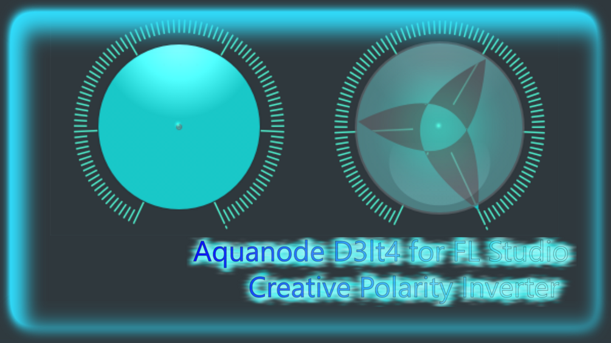

# D3lt4 Creative Polarity Inverter

D3lt4 ("Delta") is a polarity inversion / phase cancellation preset for FL Studio's Patcher environment, inspired by the "Delta" option in the EQ plugins by oeksound (e.g. Soothe2).

You can do this sort of effect in many ways in FL Studio, but D3lt4 is a very straightforward way to get it — possibly the simplest, in contrast to mixer send track routing. It linearly inverts the polarity of a dry signal (one without effects) routed in parallel to a wet signal (one where you can add your effect plugins however you like). This lets you hear **only the changes** your effects introduce into a sound, whether or not your effect (or effect chain) comes with a dry/wet option.

For example, add an equalizer with a narrow peak band and, with D3lt4 turned on, you hear only that peak — without it, you'd still hear the original sound plus a louder peak. This makes D3lt4 very useful for sound design with EQs, spectral EQs, phasers, chorus, flangers, granular FX, random FX, pitch shifters, compressors, and so on, to isolate the difference between affected and unaffected sound. Delays and reverbs usually have this built in already, but they can rarely be routed as freely as D3lt4.

By default, D3lt4 is loaded with my own [Bandpass Modulator preset](../automorph-eq/#-bandpassmod-eq-automorph-bandpassmod-eq), which you can also find in this repo.

## The Two Versions

| File | When to use |
|------|-------------|
| `Aquanode D3lt4 Creative Polarity Inverter PASSIVE.fst` | The one you usually need. |
| `Aquanode D3lt4 Creative Polarity Inverter ACTIVE.fst` | Needs your effect to have a 0% dry option. That usually means you don't need D3lt4 at all (the plugin already effectively has polarity cancelling built in) — but as the included preset project shows, D3lt4 then still keeps polarity cancelling during fade-ins and fade-outs of your effect (e.g. a reverb tail that would otherwise get cut off). |

An example project (`Aquanode D3lt4 Creative Polarity Inverter Preset Project.flp`) is included.

## How to Use

1. Add D3lt4 (PASSIVE version) to a mixer track.
2. Dial in the amount of polarity cancellation and FX volume you want (for perfect cancellation, both must usually be at the same value).
3. Go to the Mapping tab in the Patcher and find the **FX PATCHER** object (it should already be open when you add the effect). Here you can design your own FX chains with all FL Studio plugins as well as your VSTs, using Patcher's node-based structure. Tip: quickly drag existing FX VSTs from a mixer track into Patcher by right-clicking the VST, hovering over "save preset as", then click/drag/dropping it in. Patcher can hold arbitrarily many FX VSTs, in contrast to only 10 per regular mixer track.

Thank you for using my preset, I hope this makes things easier for you! — Aquanode
