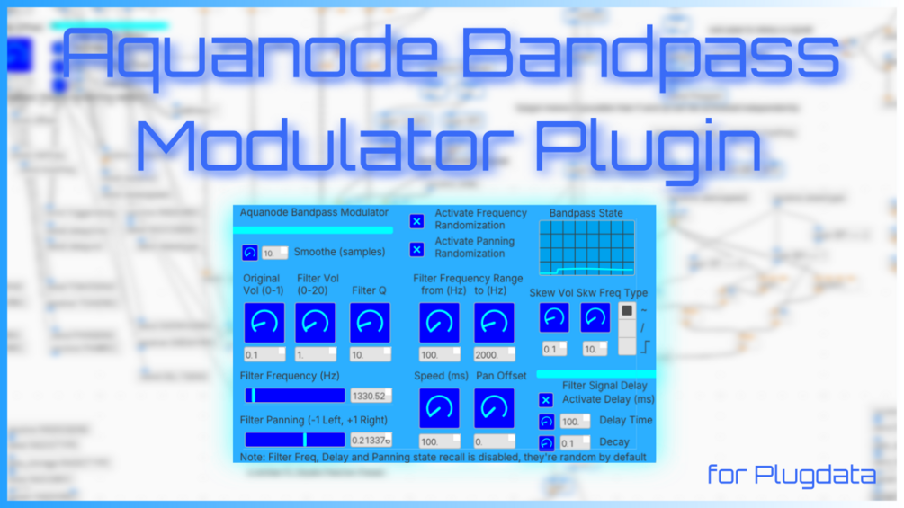

# Aquanode Bandpass Modulator (PlugData)

Aquanode Bandpass Modulator is a plugin version of my Bandpass Modulator preset for FL Studio's Patcher (included in the [AutoMorph EQ pack](../../fl-studio/automorph-eq/) in this repo).

It's a bandpass filter whose frequency and panning can be randomized in two ways, working simultaneously (or one at a time):

- a **random modulator** that makes the bandpass peak jump to a random frequency, with a controllable frequency range for the jumps, and
- a **sine/saw/square wave modulator** with variable speed that adds a skew to the random modulator (if active) or simply moves the filter around (if not).

The combined effect is that the filter slews around all over the place in jumps, with semi-smooth behaviour from the skewing in between. It performs great for everything from Filter FM-like sounds to bubbly effects to slow, mellow panning and delay. Is it special? Maybe, maybe not — you can definitely build something like this in your DAW on your own. But setting up all those randomizations takes a long time (I'm speaking from experience, since this patch is a recreation of what I previously built in FL Studio's Patcher).

🎥 Hear it in action: https://youtu.be/VQXLTRaSqiQ · The original FL Studio version: https://youtube.com/shorts/0yA7b15ckms

The plugin runs in [PlugData](https://plugdata.org/), a free and open-source plugin for many operating systems that works in pretty much all DAWs that support VSTs. And since it is a PlugData patch, you can edit everything in it! I especially recommend tinkering with the ranges of the knob controls — don't like that they span 1 to 20000 Hz and want finer control over a specific range? Go into PlugData's edit mode, click the knob, and change its range values.

| | |
|---|---|
|  |  |

## Versions / Changelog

| Version | File | Changes |
|---------|------|---------|
| v0 (alpha) | `Aquanode Bandpass Modulator v0.pd` | First version. Reloading the plugin resets all values to defaults. |
| v1 (beta) | `Aquanode Bandpass Modulator v1.pd` | State recall enabled — remembers your settings and exposes all knobs to your DAW's automation. |
| v2 (complete) | `Aquanode Bandpass Modulator v2.pd` | Like v1, plus the type of the skewing can be chosen as well. |

The original FL Studio Patcher version is also included here as `Aquanode Bandpass Modulator FL Studio Version.fst` — feel free to play around with it too if you have FL Studio (full parameter documentation in the [AutoMorph EQ README](../../fl-studio/automorph-eq/#-bandpassmod-eq-automorph-bandpassmod-eq)).

## How to Use

1. Download PlugData as a VST and use its **FX version** on the mixer track your synth or audio source is routed to.
2. Open my preset in the VST. If you see all the cables of the patch, press the plug symbol in the top right corner to go into plugin mode.
3. Each knob has its own display showing its current value. To edit knob ranges, click the pencil icon (in plugin mode) to enter PlugData's edit mode, click a knob, and edit the ranges in the menu on the right.

> **Note:** State changes are apparently not always saved in plugin mode. You can instead choose presentation mode (the third symbol in the top-middle view mode selection group), which might work better.

## Controls

**Randomization and Modulation**
- **Activate Frequency Randomization:** Enables random jumping of the filter frequency within the specified range.
- **Activate Panning Randomization:** Enables random stereo panning of the filter signal.

**Volume & Filter**
- **Smoothe (samples):** Smoothing on transitions. Set low to avoid clicks, or zero for clicky jumps.
- **Original Vol (0–1):** Dry signal level before filtering.
- **Filter Vol (0–20):** Amplitude of the filtered (wet) signal — goes up to 20 (2000%) since the filter can be quiet.
- **Filter Q:** Resonance of the bandpass filter; higher values create a narrower, sharper, louder peak.

**Filter Frequency Range**
- **From (Hz) / To (Hz):** Range used for frequency randomization; the bandpass peak only jumps within it.
- **Speed (ms):** How fast the frequency and/or panning values are updated.

**Stereo and Skew**
- **Pan Offset:** Constant offset added to the random panning values.
- **Skew Vol:** Adds a sine-based modulation layer on top of the random frequency changes; its amplitude corresponds to the frequency range you've set.
- **Skew Freq:** How fast the skew modulation cycles (LFO frequency).
- **Skew Type:** Basic shape of the skew modulator.

**Delay**
- **Activate Delay:** Enables a simple delay on the filter signal.
- **Delay Time (ms):** Time before the delayed signal plays back.
- **Decay:** Decay factor — at 0.9, each delay repeat is 90% as loud as the previous.

**Visual Feedback**
- **Bandpass State Display:** Live visualization of the filter frequency over time.
- **Filter Frequency (Hz):** Slider showing the current frequency in real time.
- **Filter Panning (−1 to +1):** Current position of the filter in the stereo field.

> Filter frequency, delay, and panning state recall is disabled — they turn on and randomize on each load until you turn the randomization options off.

## Credits

The makers of Pure Data and PlugData for making this patch possible; Ewan Bristow's EB-Morph Pure Data patch, which I dissected to understand how to make the DAW state saving work and the knob values recallable; and my earlier Bandpass Modulator built in FL Studio.

Thanks again and have fun playing around with it! — Aquanode ([bandcamp](https://aquanode.bandcamp.com) | [youtube](https://www.youtube.com/@aquanodemusic))
